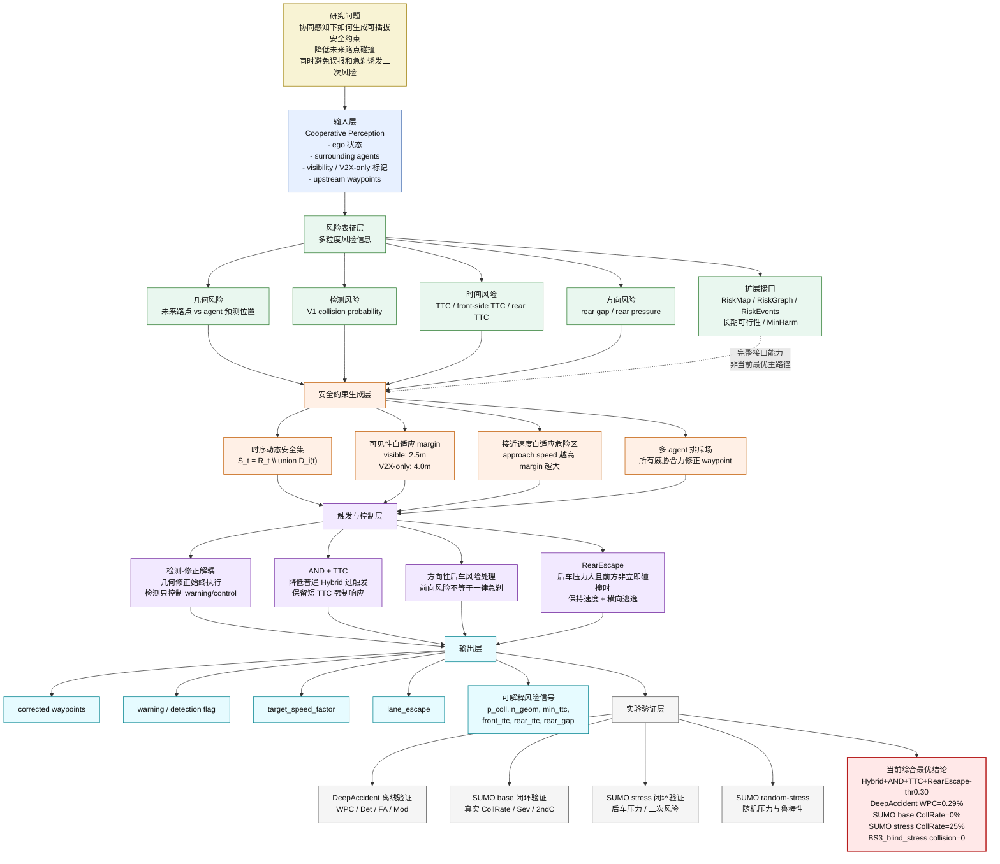
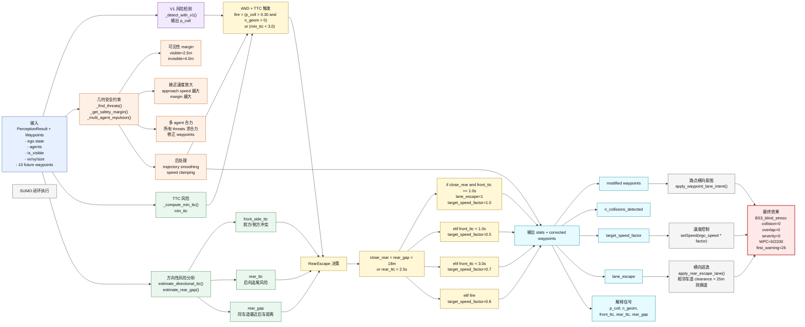
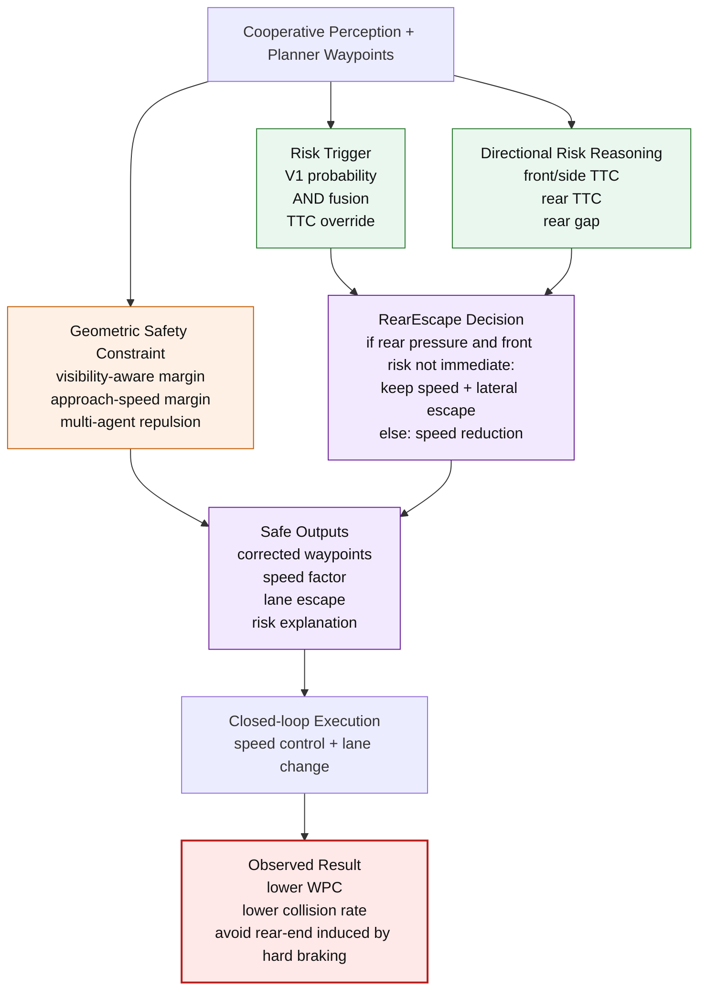

# 260615 研究设计与最优方法框架图

> 本文件从“模块功能 + 创新点”的角度画出当前研究设计方案图，并给出当前综合最优方法 `Hybrid+AND+TTC+RearEscape-thr0.30` 的算法框架图。  
> 图中不强调神经网络结构细节，而强调问题定义、模块功能、创新点和结果输出。

## 图 1：研究设计方案图

该图回答：当前研究是如何从协同感知输入出发，逐层生成安全约束，并最终在离线数据集和闭环仿真中验证效果的。

### 图 1 对应的创新点

| 创新点 | 图中位置 | 核心作用 |
|---|---|---|
| 协同感知驱动的时序安全约束 | 输入层 + 安全约束生成层 | 把 V2X 感知结果转成未来路点安全集，而不是只输出碰撞概率 |
| 可见性自适应动态安全区 | `D2` | 对 V2X-only / invisible 目标使用更大 margin |
| 接近速度自适应危险区 | `D3` | 高速接近目标生成更大动态危险区 |
| 多 agent 排斥场 | `D4` | 同时考虑所有威胁目标，避免只避一个目标 |
| 检测-修正解耦 | `E1` | 几何修正保证 WPC，检测信号控制 warning/速度 |
| AND + TTC 触发 | `E2` | 降低过触发，同时保留紧急 TTC 触发 |
| 方向性感知最小伤害式控制 | `E3` + `E4` | 区分前向风险和后向风险，避免急刹诱发追尾 |
| 可解释风险输出 | `F5` | 输出风险来源和动作原因，支持案例分析和论文解释 |

## 图 2：当前最优方法算法框架图

该图只画当前综合最优方法 `Hybrid+AND+TTC+RearEscape-thr0.30` 的实际执行路径。

### 图 2 的算法流程说明

1. 输入是统一的 `PerceptionResult` 和上游规划器未来路点。
2. V1 只输出 `p_coll`，不直接决定路点如何移动。
3. 几何模块始终执行，基于可见性、接近速度和多 agent 威胁修正未来路点。
4. TTC 模块提供 `min_ttc`，用于紧急覆盖触发。
5. AND+TTC 产生风险触发信号，降低普通 Hybrid 的过多 warning。
6. 方向性 TTC 把风险拆成 `front_side_ttc` 和 `rear_ttc`，再结合 `rear_gap` 判断是否存在后车压力。
7. RearEscape 在后车压力大且前方非 1s 内立即碰撞时，不急刹，而是输出 `lane_escape=1` 和 `target_speed_factor=1.0`。
8. SUMO 执行层把速度因子和横向逃逸意图转成真实闭环动作。

## 图 3：最优方法的简化论文版框架

如果论文或 PPT 空间有限，可以使用下面这个压缩版。

## 可直接配图说明

论文中可以这样描述图 1：

> The research design formulates cooperative driving safety as a constraint generation problem. Cooperative perception with visibility metadata is converted into multi-granularity risk signals, which are then transformed into time-indexed waypoint safety sets and directional closed-loop constraints. The final output contains corrected waypoints, speed constraints, lateral escape intent, and interpretable risk signals.

论文中可以这样描述图 2：

> The final method, Hybrid+AND+TTC+RearEscape, decouples geometric waypoint correction from risk-triggered control. The geometric branch always enforces visibility-aware multi-agent waypoint safety, while the trigger branch combines V1 probability, geometric threats, and TTC. Directional TTC and rear-gap reasoning detect rear pressure; when rear risk dominates and the front conflict is not immediate, RearEscape suppresses hard braking and activates lateral escape.
